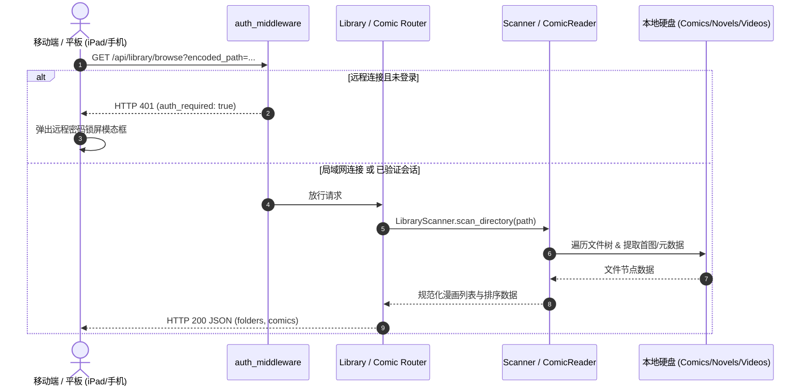

# 🤖 AGENTS.md — AI Agent 开发与系统维护指南

> **文档定位**：本指南专为接手、维护与扩展 `local-comic-reader` 项目的 AI Agent（以及协同开发者）设计。它梳理了系统的核心架构、技术选型、设计模式、代码规范、测试命令及关键避坑要点。在阅读代码或编写任何改动前，请务必完整阅读本文档。

---

## 目录
1. [项目定位与核心哲学](#1-项目定位与核心哲学)
2. [技术栈与运行时环境](#2-技术栈与运行时环境)
3. [整体架构与目录拓扑](#3-整体架构与目录拓扑)
4. [核心功能模块深度解析](#4-核心功能模块深度解析)
5. [数据流与通信协议](#5-数据流与通信协议)
6. [测试与运行命令参考](#6-测试与运行命令参考)
7. [Agent 编码规范与设计约束](#7-agent-编码规范与设计约束)
8. [关键踩坑记录与防御性编程守则](#8-关键踩坑记录与防御性编程守则)

---

## 1. 项目定位与核心哲学

### 1.1 业务背景
许多用户在个人 PC 硬盘中存储了海量漫画画集（ZIP/CBZ/PDF/图片目录）、轻小说（TXT/EPUB/MOBI/AZW3）与动画/短视频（MP4/MKV/WEBM）。但在日常使用中存在以下痛点：
- 躺在床上用 iPad / 手机看书时，不想通过 USB 或聊天软件繁琐导入文件，也不想占用手机宝贵的存储空间；
- 出门在外通过 5G 移动流量时，希望能像访问个人云一样直接串流家中的藏书与视频，但普通家庭宽带缺少公网 IPv4，第三方云中继穿透慢且需要额外月费；
- 不希望在 PC 上配置复杂的反向代理、数据库或臃肿的 Docker 堆栈。

### 1.2 核心设计哲学
1. **Zero-Build 前端架构**：前端采用原生浏览器加载的 Vue 3 + Tailwind CSS（Local Vendor 本地离线化分发），**完全杜绝 Node.js/Vite/Webpack 打包流程**。修改任何 HTML/CSS/JS 即时刷新生效，保证即便十年后没有 npm 源也依然能开箱运行。
2. **轻量、低功耗与无外部依赖**：服务端基于轻量级 FastAPI，数据通过 JSON 扁平持久化（`data/config.json`），常驻内存不足 50MB，CPU 占用基本为 0%，可长期后台驻留。
3. **安全边界第一**：所有文件路径访问强制经过书架根目录白名单比对（`is_path_allowed`），杜绝任何目录穿越漏洞。
4. **双栈支持与独立隔离**：默认占用 `7891` 独立端口（端口冲突时自动顺延），原生支持局域网 IPv4 与外网 IPv6 直连。当检测到来自外网公网的远程连接时，强制触发安全锁屏。
5. **端侧极致体验**：支持双页合并排版（展开实体书拟真体验）、日漫右向左翻页（RTL）、双指捏合缩放（Pinch-to-zoom）、三档暗色/亮色外观无缝跟随系统。

---

## 2. 技术栈与运行时环境

### 2.1 后端技术栈
| 技术 / 库 | 版本约束 | 用途说明 |
| :--- | :--- | :--- |
| **Python** | 3.9+ (兼容 3.14) | 服务端开发语言 |
| **FastAPI** | >= 0.100.0 | 高性能异步 RESTful Web 框架 |
| **Uvicorn** | >= 0.22.0 | ASGI 高性能 Web 服务器 |
| **PyMuPDF (`fitz`)** | 最新稳定版 | PDF 漫画极速解析与页面栅格化渲染 |
| **Pillow (`PIL`)** | 最新稳定版 | 图像解码、WebP 动态压缩、旋转校正与小说封面绘制 |
| **natsort** | 最新稳定版 | 文件名自然排序（如 `page_1` -> `page_2` -> `page_10`） |
| **python-multipart** | 最新稳定版 | 支持表单文件上传解析 |

### 2.2 前端技术栈
| 技术 / 库 | 加载方式 | 用途说明 |
| :--- | :--- | :--- |
| **Vue 3** | 本地 `vue.global.prod.js` | 声明式响应式 UI 渲染，Composition API |
| **Tailwind CSS** | 本地 `tailwind.min.js` | 工具优先原子 CSS 引擎 |
| **CSS3 毛玻璃** | 本地 `css/style.css` | 支持深色/浅色、毛玻璃、阅读器排版 |
| **原生触控模块** | 本地 `js/touch.js` | 双指缩放、滑动翻页、边缘触控手势 |
| **轻小说排版引擎** | 本地 `js/modules/novelReader.js` | 智能分章、字号缩放、4 款阅读主题 |

---

## 3. 整体架构与目录拓扑

```text
local-comic-reader/
├── run.py                 # 【核心入口】跨平台启动器，环境自检、动态端口检测、防火墙检测、Uvicorn 托管
├── run.bat                # Windows 快速双击运行脚本
├── run.sh                 # Linux / macOS 执行权限启动脚本
├── allow_firewall.bat     # Windows 防火墙入站规则一键放行工具
├── test_app.py            # 全功能综合集成测试脚本 (含自动化测试资产生成)
├── requirements.txt       # Python 依赖清单
├── backend/               # 【后端服务端模块】
│   ├── app.py             # FastAPI App 实例化、CORS、全局认证拦截中间件、静态资产路由
│   ├── auth.py            # 认证鉴权、密码哈希比对、公网远程 IP 探测、会话 Token
│   ├── config.py          # 配置文件持久化 (data/config.json 读写操作)
│   ├── collections.py     # 收藏夹 (Favorites)、稍后再看 (Read Later)、自定义分类 (Categories)
│   ├── scanner.py         # 书架与文件树遍历、封面文件探测、文件元数据获取
│   ├── reader.py          # 漫画/画集/PDF 页面解包、WebP 转换、双级缓存 (内存+磁盘)
│   ├── novel.py           # TXT/EPUB/MOBI 智能分章、多编码识别 (UTF-8/GBK)
│   ├── utils.py           # 路径 Base64 编解码、自然排序、本机 IP (v4/v6) 扫描、防火墙检测
│   └── routers/           # 模块化 REST API 路由
│       ├── __init__.py    # 路由汇总聚合器 (api_router)
│       ├── auth.py        # 登录、登出、认证状态、安全设置端点
│       ├── system.py      # 系统局域网与 IPv6 地址探测、防火墙一键放行
│       ├── library.py     # 目录浏览、书架增删、全局秒级模糊搜索
│       ├── comic.py       # 漫画元数据、分页流式读取、缩略图、整本打包下载
│       ├── video.py       # 视频流式分片点播 (HTTP 206)、视频首帧抽帧缩略图
│       └── collections.py # 收藏、稍后再看、分类 CRUD
├── frontend/              # 【前端 SPA 单页系统 (免构建)】
│   ├── index.html         # 核心 SPA 入口页面（包含书架、目录、阅读器、各种设置弹窗）
│   ├── css/
│   │   └── style.css      # 自定义主题样式、暗色/亮色自适应覆盖、滚动条与毛玻璃
│   ├── js/
│   │   ├── app.js         # Vue 3 应用主逻辑、全局响应式状态、交互事件绑定
│   │   ├── i18n.js        # 中英双语国际化字典
│   │   ├── touch.js       # 触屏手势处理器 (Pinch/Swipe/DoubleTap)
│   │   └── modules/
│   │       ├── api.js     # 前后端 API 交互封装
│   │       ├── comicReader.js  # 漫画阅读器状态机 (翻页/双页/瀑布流)
│   │       └── novelReader.js  # 小说阅读器排版、字号、主题切换
│   └── vendor/            # 本地离线第三方前端库 (Tailwind, Vue)
└── data/                  # 【数据与持久化目录】
    ├── config.json        # 书架路径、安全密码、DDNS 配置、阅读偏好持久化文件
    └── cache/             # 缩略图与 WebP 动态压缩持久化磁盘缓存
```

---

## 4. 核心功能模块深度解析

### 4.1 运行时引擎与自适应网络 (`run.py`)
- **自动环境补齐**：启动时自动扫描当前环境依赖，若缺少库自动调用镜像源一键静默安装。
- **端口冲突自适应**：默认从 `7891` 端口开始嗅探。若端口被占用，自动递增寻找可用端口，避免与其他本地网络服务（如游戏服务器、Web 代理）发生端口冲突。
- **编码安全防御**：Windows 环境下执行命令行检测防火墙规则时，严格采用 `errors='replace'` 规避 GBK 中文编码解码异常。

### 4.2 认证中间件与远程 IP 探测 (`backend/auth.py` + `backend/app.py`)
- **`auth_middleware` 机制**：
  - 静态资源 (`/static/*`)、登录页、`/api/auth/*` 与系统连接信息端点 (`/api/info`) 白名单免检。
  - 通过 `is_remote_ip(request.client.host)` 分析请求来源。若为局域网私有网段（`127.0.0.1`, `10.x.x.x`, `172.16.x.x`, `192.168.x.x`, `fe80::` 等），且开启了「局域网免密直连」，则允许免密通行。
  - 当检测到公网 IPv6 或互联网远程访问，且系统配置了密码时，直接拦截并返回 `401 {"auth_required": true}`，前端自动弹出安全锁屏。

### 4.3 漫画与媒体流引擎 (`backend/reader.py` & `backend/routers/comic.py`)
- **零拷贝多态读取**：
  - 支持直接读取文件夹、ZIP/CBZ 压缩包内流式解压、PDF 页面矢量渲染。
  - 动态 WebP 转码：在弱网模式（Turbo Mode）下，根据视口分辨率动态缩放并压缩为高效 WebP，显著提升平板在公网 IPv6 下的翻页流畅度。
  - 双级缓存机制：采用 LRU 内存缓存（`_MEM_THUMB_CACHE`）+ 磁盘 MD5 分级目录缓存（`data/cache/xx/xxxx.webp`），大幅降低二次打开时的磁盘 IO。

### 4.4 视频分片流式点播 (`backend/routers/video.py`)
- **HTTP Range 206 支持**：实现标准分片传输头（`Accept-Ranges: bytes`），支持用户在手机端随意拖动进度条，免去下载整部视频的等待。
- **首帧抽帧生成海报**：自动调用本地 `ffmpeg`（若已安装）抽取视频首帧作为网格卡片封面；若无 ffmpeg 则降级为内置精美视频占位图标。

### 4.5 智能分章小说引擎 (`backend/novel.py`)
- **编码智能推断**：针对国内下载的 TXT 小说，按顺序测试 `utf-8` -> `gb18030` -> `gbk` -> `utf-16`，解决乱码困扰。
- **智能分章正则**：匹配多种常见分章标志（`第X章/回/节`、`Chapter`、`卷`等）；对于无章节的长文本，自动按字数分段，防止超长文本导致移动端 DOM 卡死。

---

## 5. 数据流与通信协议



---

## 6. 测试与运行命令参考

### 6.1 运行服务
```bash
# 方式一：推荐跨平台引导脚本
python run.py

# 方式二：macOS / Linux Shell
./run.sh

# 方式三：Windows CMD / PowerShell
run.bat
```

### 6.2 执行自动化集成测试
项目内置了完整的全功能端到端测试套件 `test_app.py`，会动态生成模拟的漫画压缩包、PDF、电子书、视频与图片目录，测试所有端点与权限边界：
```bash
# 使用本地虚拟环境运行测试
./venv/bin/python test_app.py

# 或使用当前环境的 Python 运行
python test_app.py
```
> **通过标准**：终端输出所有断言绿勾并显示 `🎉 ALL TESTS PASSED SUCCESSFULLY!`。

---

## 7. Agent 编码规范与设计约束

### 7.1 路径与跨平台兼容守则
- **永远使用 `pathlib.Path`** 处理文件路径，绝对禁止使用硬编码的正反斜杠字符串拼接。
- **路径 Base64 编解码**：前端向后端传递文件路径时，必须通过 `utils.encode_path()` 与 `utils.decode_path()`，以防不同操作系统下路径特殊字符（空格、井号、中文、括号）破坏 URL 语义。
- **书架安全沙箱约束**：任何直接访问文件系统的 API 端点，必须调用 `is_path_allowed(path, allowed_roots)` 检查其是否处于合法书架目录内。**绝不允许越权访问操作系统的其它目录！**

### 7.2 前端无构建链设计契约
- **禁止引入 Node 构建工具**：绝不要在项目中添加 `package.json` 构建构建命令（如 `npm run build`）。所有修改必须保持前端纯静态运行。
- **缓存规避机制**：若修改了 `frontend/css/style.css` 或 `frontend/js/*.js`，必须同步在 `frontend/index.html` 中的引用链接上递增版本号参数（例如 `href="/static/css/style.css?v=1.3.8"`），以确保移动端浏览器即时刷新缓存。

### 7.3 外观与深浅色模式规范
- **Tailwind 原子类与纯 CSS 协调**：
  - 项目根节点通过 `<html class="dark">` 或 `<html class="light">` 切换外观。
  - 由于 HTML 模板中大量基础类是按深色风格编写（如 `bg-zinc-900`, `text-zinc-100`），亮色模式主要依赖 `frontend/css/style.css` 中的 `html.light` 属性选择器实现全局精准覆盖。
  - **组件样式一致性**：新增任何浮动按钮、角标、徽章或弹窗时，必须检查其在亮色模式下的表现。对于半透明遮罩（如封面按钮），亮色模式下应使用**高透磨砂毛玻璃浅底**（`rgba(255, 255, 255, 0.88)` + `#334155` 文字），严禁出现黑底暗字的“暗色残留”。

### 7.4 国际化 (i18n) 契约
- 凡是用户可见的文字（按钮提示、标题、操作反馈、弹窗描述），均须在 `frontend/js/i18n.js` 中同时配置 `zh` 与 `en` 键值对，并通过 `t('key')` 调用，保持系统完整的中英双语切换能力。

---

## 8. 关键踩坑记录与防御性编程守则

1. **Windows 子进程编码崩溃 (`UnicodeDecodeError: 'gbk'`)**：
   - *问题根源*：在 Windows 简体中文版下，`subprocess` 默认使用 GBK 解码系统输出，当检测防火墙或系统信息时遇到 UTF-8 多字节字符会抛出致命异常。
   - *修复方案*：在所有调用 `subprocess.run` 或 `Popen` 处，显式指定 `errors='replace'` 或 `encoding='utf-8', errors='ignore'`。
2. **Windows 临时 IPv6 导致的 DDNS 失联**：
   - *问题根源*：Windows 会为物理网卡自动分配多个生命周期短的临时 IPv6 地址（Temporary IPv6），如果将临时地址绑定到 DDNS，数小时后就会失效。
   - *解决规范*：推荐用户使用 `ddns-go` 配合 `@1` 语法锁定首个稳定公网单播 IPv6 地址（`2000::/3` 范围），并在 `backend/utils.py` 获取本机 IP 时优先排除 `fe80::` 链路本地地址。
3. **Dynv6 域名冲突**：
   - 在配置 Dynv6 时，用户如果配置了完整主域名（Zone 根地址），应直接更新 Zone IPv6，而非在二级 AAAA 记录中重复添加导致冲突。
4. **全屏与移动端 Safe Area 适配**：
   - 移动端顶部与底部有状态栏和横条（Home Indicator），页面必须声明 `<meta name="viewport" content="..., viewport-fit=cover">`，并使用 Tailwind 的 `pt-safe` / `pb-safe` 或 CSS 环境变量 `env(safe-area-inset-top)` 保障内容不被遮挡。
